# Orquestación compleja de Skills — caso de ejemplo

**Caso:** *"Aria"*, un agente autónomo de **operaciones de un e-commerce**. Recibe pedidos por chat/eventos,
los **enruta** a la skill correcta, que a su vez combina **MCPs** (acceso), **scripts**, **sub-skills** y
**subagentes** aislados. Ejemplo para mostrar cómo se ve una orquestación real a gran escala.

---

## 1) Mapa de arquitectura (capas)

```
 ENTRADAS (10 prompts de ejemplo, multi-canal: Slack / Telegram / Email / Webhook)
 ├─ "reembolsa el pedido #1234"            ├─ "responde el ticket de soporte #88"
 ├─ "despliega la v2.3 a producción"       ├─ "agenda la demo con el lead"
 ├─ "¿por qué cayó el checkout?"           ├─ "lanza la campaña de Black Friday"
 ├─ "onboarda al cliente ACME"             ├─ "concilia los pagos de octubre"
 └─ "genera el reporte semanal de ventas"  └─ "audita los accesos de seguridad"
                              │
                              ▼
   ╔══════════════════════════════════════════════════════════════════════════╗
   ║   ORQUESTADOR (router de intención + contexto global + aplica RULES)      ║
   ║   discovery: lee name+description de las 10 skills (~800 tokens total)    ║
   ╚══════════════════════════════════════════════════════════════════════════╝
        │                                                          ▲
        │ activa la skill que matchea                              │ guardrails
        ▼                                                          │
 ┌──────────────────────── SKILLS (playbooks: CÓMO) ───────────┐  ┌──┴───────────────┐
 │ 1 handle-refund      6 support-reply                        │  │  RULES           │
 │ 2 deploy-release     7 schedule-meeting                     │  │  - no prod sin    │
 │ 3 triage-incident    8 launch-campaign                      │  │    aprobación     │
 │ 4 onboard-customer   9 reconcile-payments                   │  │  - no PII en logs │
 │ 5 weekly-report     10 security-audit                       │  │  - budget cap     │
 └───────┬───────────────────────────┬───────────────────┬─────┘  │  - sandbox/roles  │
         │ usa (acceso)              │ compone (sub-skill)│ delega └──────────────────┘
         ▼                           ▼                    ▼
 ┌───────────────── MCP (conectividad: PUEDE) ────────────┐  ┌──── SUBAGENTES (aislados) ────┐
 │ Slack  Gmail  Calendar  GitHub  Stripe                  │  │ research-subagent             │
 │ Shopify  Notion  Linear  Datadog  AWS                   │  │ code-fix-subagent             │
 └─────────────────────────────────────────────────────────┘  │ data-analysis-subagent        │
        cada MCP = un server (credenciales aisladas)           │ (devuelven SÍNTESIS, no todo) │
                                                               └───────────────────────────────┘
```

---

## 2) Diagrama Mermaid (para slides)

```mermaid
flowchart TB
  classDef orch fill:#4b2e22,color:#fff,stroke:#222,stroke-width:2px;
  classDef skill fill:#f3dcc2,color:#3a2418,stroke:#8f4a2f;
  classDef mcp fill:#2f6f73,color:#fff,stroke:#1c4446;
  classDef sub fill:#b8753a,color:#fff,stroke:#7a4a22;
  classDef rule fill:#fff,color:#8f2f2f,stroke:#8f2f2f,stroke-dasharray:4 3;

  IN["📥 Prompts / eventos (Slack · Telegram · Email · Webhook)"]
  ORCH["🧠 ORQUESTADOR<br/>router + contexto + rules"]:::orch
  RULES["🚧 RULES / guardrails<br/>no prod · no PII · budget · sandbox"]:::rule

  IN --> ORCH
  RULES -.controla.-> ORCH

  subgraph SKILLS["SKILLS (playbooks — CÓMO)"]
    direction LR
    S1[handle-refund]:::skill
    S2[deploy-release]:::skill
    S3[triage-incident]:::skill
    S4[onboard-customer]:::skill
    S5[weekly-report]:::skill
    S6[support-reply]:::skill
    S7[schedule-meeting]:::skill
    S8[launch-campaign]:::skill
    S9[reconcile-payments]:::skill
    S10[security-audit]:::skill
  end
  ORCH --> SKILLS

  %% composición: skill que llama sub-skill
  S3 -. rollback .-> S2
  S4 -. agenda .-> S7
  S4 -. crea ticket .-> S6
  S8 -. métricas .-> S5
  S9 -. auto-refund .-> S1

  subgraph MCPS["MCP (conectores — PUEDE)"]
    direction LR
    M1[Slack]:::mcp
    M2[Gmail]:::mcp
    M3[Calendar]:::mcp
    M4[GitHub]:::mcp
    M5[Stripe]:::mcp
    M6[Shopify]:::mcp
    M7[Notion]:::mcp
    M8[Linear]:::mcp
    M9[Datadog]:::mcp
    M10[AWS]:::mcp
  end

  %% enlaces representativos skill -> MCP (mapeo completo en la tabla)
  S1 --> M5 & M6 & M2
  S2 --> M4 & M10 & M9
  S3 --> M9 & M4 & M8
  S5 --> M6 & M5 & M7
  S8 --> M6 & M2 & M1

  subgraph SUBS["SUBAGENTES (aislados — devuelven síntesis)"]
    direction LR
    A1[research-subagent]:::sub
    A2[code-fix-subagent]:::sub
    A3[data-analysis-subagent]:::sub
  end
  S3 --> A1
  S2 --> A2
  S5 --> A3
```



---

## 3) Mapeo Skill ↔ MCP (el "mesh" sin spaghetti)

| Skill | MCPs que usa | Sub-skills que invoca |
|---|---|---|
| handle-refund | Stripe · Shopify · Gmail · Slack | — |
| deploy-release | GitHub · AWS · Datadog · Slack | code-fix-subagent |
| triage-incident | Datadog · GitHub · Linear · Slack | → deploy-release · research-subagent |
| onboard-customer | Shopify · Notion · Gmail · Calendar | → schedule-meeting · support-reply |
| weekly-report | Shopify · Stripe · Datadog · Notion | data-analysis-subagent |
| support-reply | Linear · Gmail · Slack · Notion | — |
| schedule-meeting | Calendar · Gmail · Slack | — |
| launch-campaign | Shopify · Gmail · Slack | → weekly-report |
| reconcile-payments | Stripe · Shopify · Notion | → handle-refund |
| security-audit | AWS · GitHub · Linear · Slack | — |

---

## 4) Un flujo concreto: "¿por qué cayó el checkout?"

```
"¿por qué cayó el checkout?"
   │
   ▼  ORQUESTADOR → matchea → SKILL: triage-incident
   ├─(1) MCP Datadog ── lee métricas/errores → pico de 500 en /checkout
   ├─(2) SUBAGENTE research ── investiga logs + commits (aislado) → "deploy 14:02 rompió Stripe v3"
   │        └─ devuelve SÍNTESIS (1 párrafo), no 4000 líneas de logs
   ├─(3) MCP Linear ── crea incidente P1
   ├─(4) SUB-SKILL deploy-release ── ejecuta ROLLBACK
   │        └─ MCP GitHub (revert) + MCP AWS (redeploy) + SUBAGENTE code-fix (patch)
   ├─(5) MCP Slack ── avisa al canal #incidentes
   └─ RULES verifican en cada paso: ¿requiere aprobación humana para tocar prod? → pausa y pregunta
   ▼
   "Incidente resuelto: rollback aplicado, checkout OK. Causa: deploy 14:02 (Stripe v3)."
```

---

## 5) Cómo leer el gráfico (claves para el taller)
- **3 capas:** MCP = *qué puede* · Skills = *cómo* · Rules = *qué no*. Planos separados → componible.
- **Progressive disclosure:** el orquestador conoce las 10 skills por su `description` (barato);
  solo carga el `SKILL.md` completo de la que activa.
- **Composición:** una skill puede llamar **otra skill** (líneas punteadas) → serial/condicional/recursivo.
- **Subagentes:** trabajo pesado y aislado; devuelven **síntesis**, no el transcript → no inflan el contexto.
- **Seguridad:** con 10 MCPs (10 sets de credenciales) y skills que tocan prod, los **guardrails**
  y el **sandbox** son obligatorios — una skill comprometida correría con TODOS esos permisos.
